```mermaid
gantt
    title Fasi del Sonno durante la Notte
    dateFormat HH:mm
    axisFormat %H:%M
    Leggero      :active, 00:00, 2h
    Pesante      :active, 02:00, 3h
    REM          :active, 05:00, 1h
    Pesante      :active, 06:00, 1h
    Leggero      :active, 07:00, 1h
```

# Visualizzazione dei Dati
Lorem ipsum dolor sit amet, consectetur adipiscing elit. Sed sit amet nulla ac lectus euismod ullamcorper. Vivamus laoreet ex non tortor faucibus, a efficitur ante posuere. Morbi pretium cursus tincidunt.

## Numeri di Passi

Lorem ipsum dolor sit amet, consectetur adipiscing elit. Sed sit amet nulla ac lectus euismod ullamcorper. Vivamus laoreet ex non tortor faucibus, a efficitur ante posuere. Morbi pretium cursus tincidunt.

## Frequenza Cardiaca

Lorem ipsum dolor sit amet, consectetur adipiscing elit. Sed sit amet nulla ac lectus euismod ullamcorper. Vivamus laoreet ex non tortor faucibus, a efficitur ante posuere. Morbi pretium cursus tincidunt.

### Oggi

### Settimana Corrente

## Sonno

Lorem ipsum dolor sit amet, consectetur adipiscing elit. Sed sit amet nulla ac lectus euismod ullamcorper. Vivamus laoreet ex non tortor faucibus, a efficitur ante posuere. Morbi pretium cursus tincidunt.

